<div align="center">

# virsh-tui

A keyboard-driven terminal UI for libvirt, with vim keys and live graphs.

[](https://github.com/SyscallBrain/virsh-tui/actions/workflows/ci.yml)
[](https://syscallbrain.github.io/virsh-tui/)
[](LICENSE)
[](https://www.rust-lang.org)
[](https://ratatui.rs)
[](#install)

[Documentation](https://syscallbrain.github.io/virsh-tui/) ·
[Install](#install) ·
[Key bindings](https://syscallbrain.github.io/virsh-tui/keys.html) ·
[Report a bug](https://github.com/SyscallBrain/virsh-tui/issues/new?template=bug_report.yml)

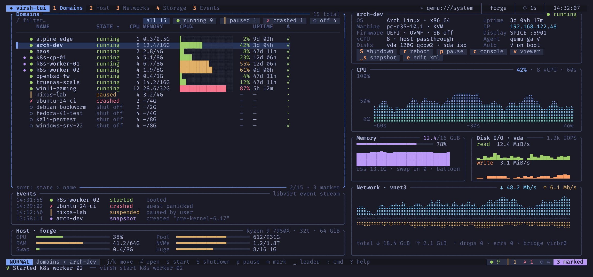

</div>

virsh-tui shows every virtual machine on a libvirt connection with live CPU,
memory, disk and network graphs, and lets you start, stop, snapshot,
reconfigure and create them from the keyboard. Every action is a `virsh` (or
`virt-install`) command, and virsh-tui shows you that command before and
after it runs, so nothing happens behind your back and you can reuse it in a
script.

It works with `qemu:///system`, `qemu:///session` and remote hosts over
`qemu+ssh://`, with the same permissions `virsh` has.

## Features

- Domains list with state chips, filtering, sorting, marks and bulk actions
- Lifecycle keys: start, ACPI shutdown (tracked until the guest stops),
  destroy, reboot, reset, pause, managed save, autostart, undefine
- Live monitor per domain: per-vCPU meters, memory and balloon, per-disk and
  per-NIC rates, with 60 s, 5 min and 1 h history
- Hardware editor that shows the XML diff and the exact commands before you
  apply with `:w`
- Snapshot tree with create, revert and delete
- Host view with per-thread CPU, memory, hugepages, KSM, pools and networks
- Networks with DHCP leases, owning domains, and pinning a lease as a static entry
- Storage pools and volumes with backing chains, plus ISO insert and eject
- Live libvirt event stream for domains, networks and pools
- Six-step new domain wizard that builds and runs `virt-install`
- `:` command line with Tab completion for commands, domains, themes, paths
  and every `virsh` flag; anything else is passed to `virsh`
- Fuzzy command palette, which-key hints, remappable keys
- Nine themes plus custom ones, a settings screen, and a 256-colour fallback
- `--dry-run` to see what each key would run, `--demo` to try it with no
  libvirt at all

## Screenshots

| | |
|:-:|:-:|
| 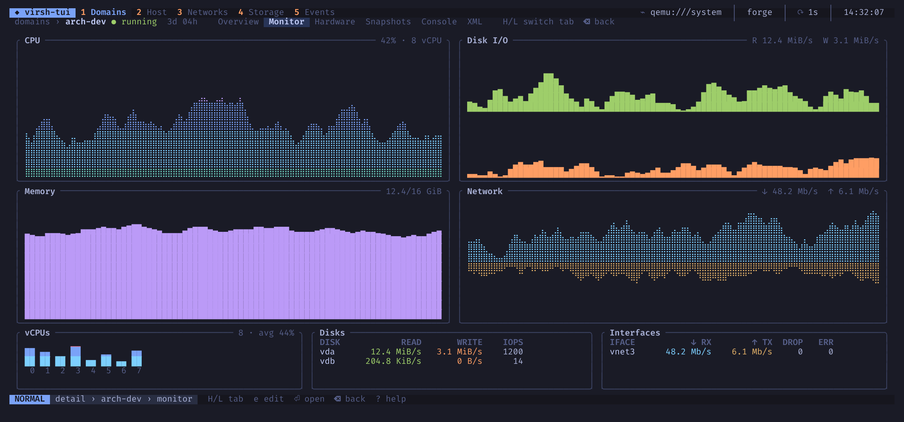 | 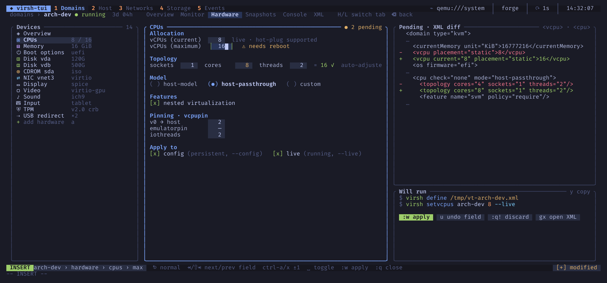 |
| Live monitor | Hardware editor with XML diff |
| 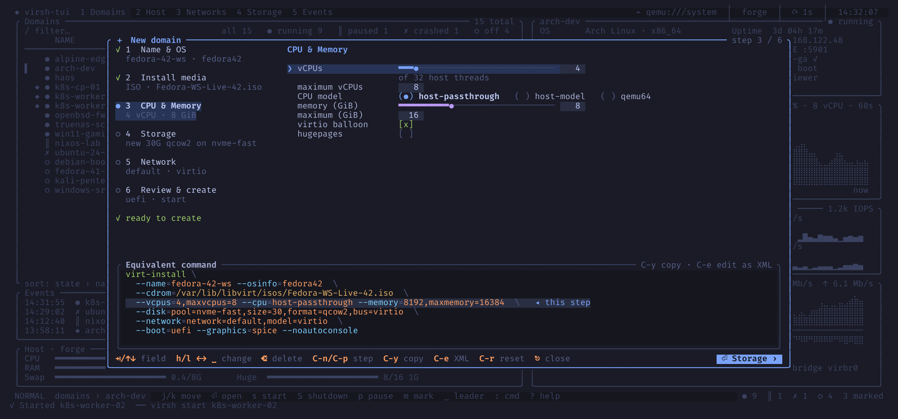 | 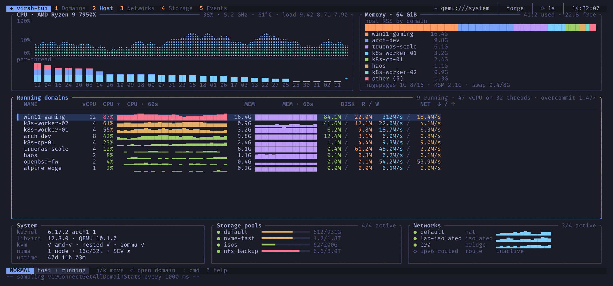 |
| New domain wizard | Host |
| 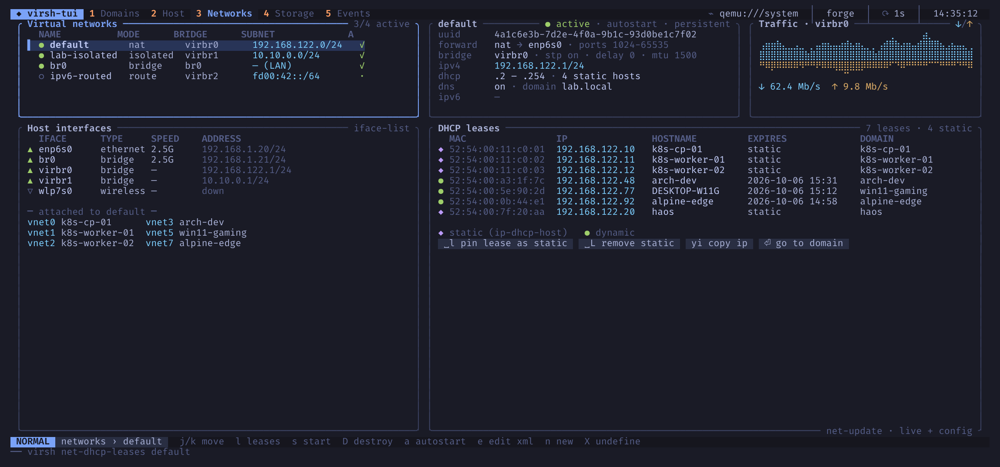 |  |
| Networks and DHCP leases | Command palette |
| 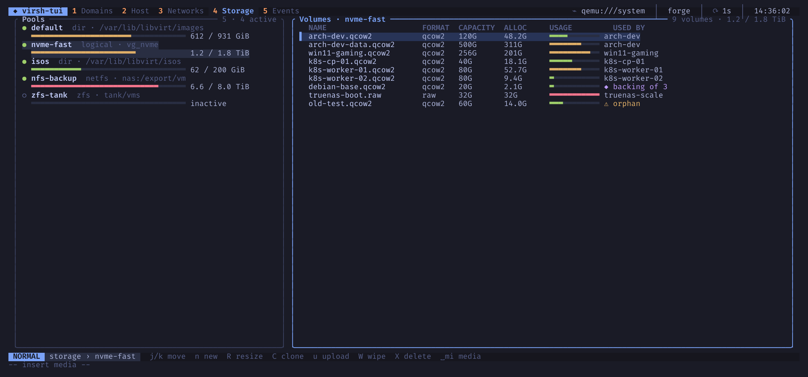 | 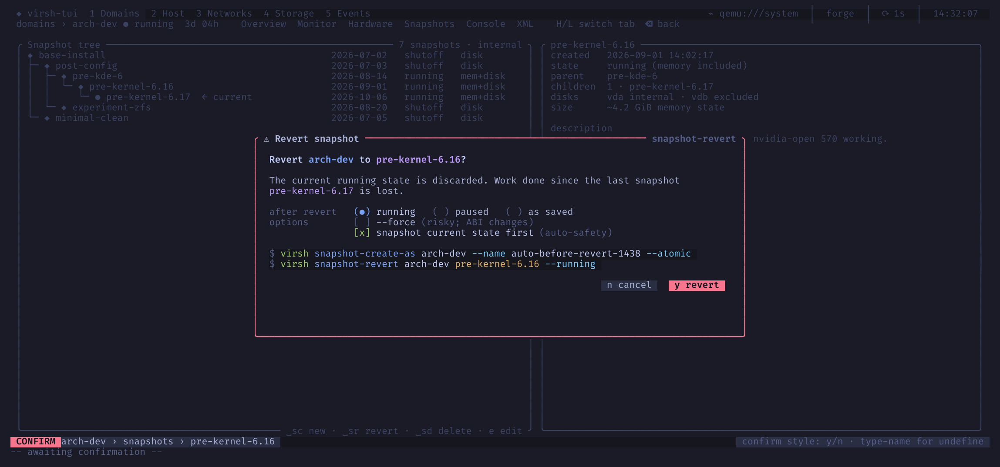 |
| Storage pools and volumes | Snapshot tree |

<details>
<summary>Themes</summary>

| | |
|:-:|:-:|
| 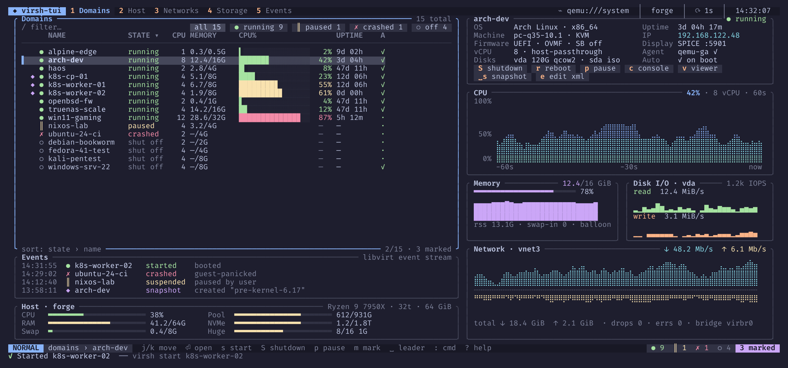 | 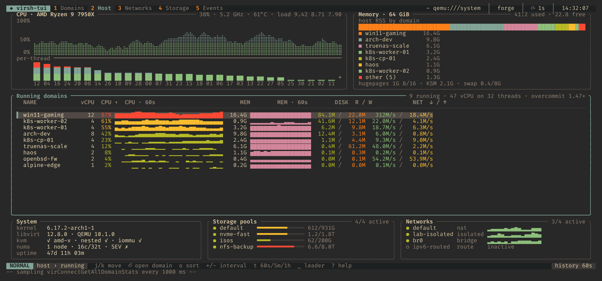 |
| catppuccin-mocha | gruvbox-dark |
| 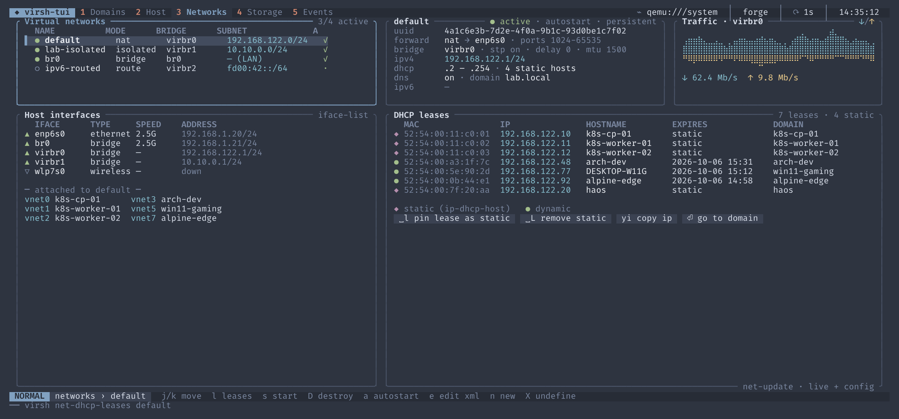 | 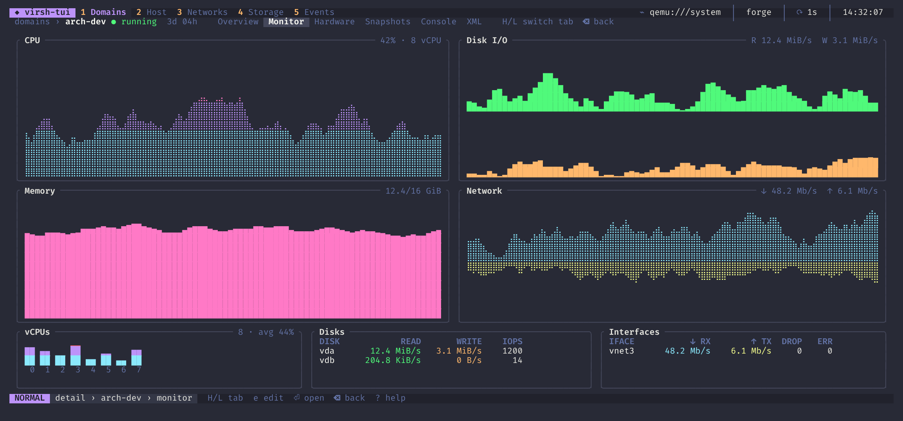 |
| nord | dracula |

</details>

All screenshots come from `--demo` mode.

## Install

You need Linux, the libvirt client tools (`virsh`) and Rust 1.88 or newer.
`virt-install` is used by the new domain wizard and `virt-viewer` by the
graphical viewer.

```sh
cargo install --locked --git https://github.com/SyscallBrain/virsh-tui
```

Or build from a clone:

```sh
git clone https://github.com/SyscallBrain/virsh-tui
cd virsh-tui
cargo build --release
./target/release/virsh-tui
```

To manage `qemu:///system`, your user must be allowed to use it, which on
most distributions means being in the `libvirt` group. The
[installation guide](https://syscallbrain.github.io/virsh-tui/installation.html)
has the details.

## Quick start

```sh
virsh-tui                        # default URI (qemu:///system)
virsh-tui -c qemu:///session     # per-user daemon
virsh-tui -c qemu+ssh://me@host/system
virsh-tui --demo                 # example data, nothing runs
virsh-tui --dry-run              # show commands instead of running them
```

| Key | Action |
|-----|--------|
| `j` / `k`, `gg` / `G` | move |
| `Enter` / `Backspace` | open / back |
| `1` … `5` | Domains, Host, Networks, Storage, Events |
| `s` / `S` / `D` | start / shutdown / destroy |
| `p` / `r` / `R` | pause-resume / reboot / reset |
| `c` / `v` / `e` | console / viewer / edit XML |
| `/` | filter |
| `Space` | leader key: new domain, clone, snapshots, media… |
| `:` | command line (`Tab` completes) |
| `Ctrl-p` | command palette |
| `?` | all key bindings |
| `,` | settings |
| `q` | quit |

## Documentation

The [user guide](https://syscallbrain.github.io/virsh-tui/) covers every view,
the wizard, the command line, configuration, themes, key remapping and
troubleshooting. Its source is in [`book/`](book/src/SUMMARY.md).

## Configuration

Settings live in `~/.config/virsh-tui/config.toml`, key overrides in
`keymap.toml` and custom themes in `themes/`. The settings screen (`,`) and
`:set key=value` write the file for you. See
[Configuration](https://syscallbrain.github.io/virsh-tui/configuration.html).

## Contributing

Issues and pull requests are welcome. Read
[CONTRIBUTING.md](CONTRIBUTING.md) for how to build, test and regenerate the
screenshots.

## License

[MIT](LICENSE)
