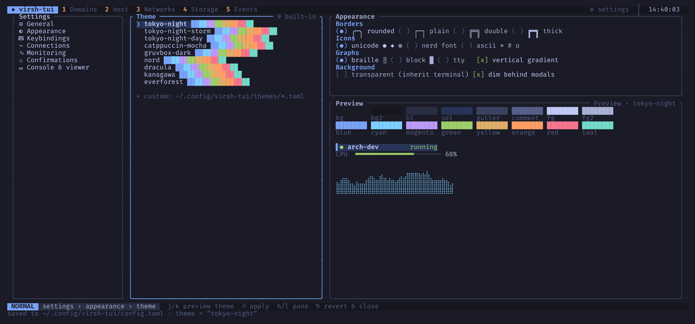

# Configuration

virsh-tui reads `~/.config/virsh-tui/config.toml` (or `$XDG_CONFIG_HOME`).
The file is optional; every key has a default. The settings screen (`,`) and
`:set key=value` write changes back to the same file, so you rarely need to
edit it by hand. `--config <path>` uses another file, and changes made in
the app are saved there.



## Full example with the defaults

```toml
[general]
default_uri = "qemu:///system"   # used when -c/--connect is not given
refresh_interval_secs = 1        # how often stats are sampled
editor = "vi"                    # used when $VISUAL and $EDITOR are unset
start_view = "domains"           # domains, host, networks, storage, events
confirm_style = "yn"             # reserved, not used yet

[appearance]
theme = "tokyo-night"            # built-in name or a file in themes/
transparent = false              # use the terminal background
borders = "rounded"              # rounded, plain, double, thick
icons = "unicode"                # unicode, nerd, ascii
graphs = "braille"               # braille, block, tty
gradient = true                  # colour bars by level (green, yellow, red)
dim_modals = true                # dim the screen behind dialogs

[connections]
uris = [                         # offered by :connect completion and Settings
  "qemu:///system",
  "qemu:///session",
  "qemu+ssh://user@host/system",
]
default = "qemu:///system"

[monitoring]
balloon_on = false               # set a balloon stats period on running guests
balloon_period_secs = 2
thread_sampling = true           # per-thread CPU meters in the Host view

[confirmations]
destroy = true
reset = true
undefine = true
revert = true                    # snapshot revert
delete_volume = true
wipe = true
type_name_for_undefine = true    # type the domain name to undefine

[console]
viewer = "virt-viewer"           # or "remote-viewer"
escape = "C-]"                   # key that leaves the serial console
```

## Notes on some settings

`monitoring.balloon_on` is off by default because it runs
`virsh dommemstat --period N --live` on running domains, which changes their
configuration. Without it, the memory graphs show what libvirt reports
without a stats period: the balloon size and RSS, but not the guest's own
view of free memory.

`console.viewer = "remote-viewer"` makes `v` ask libvirt for the display URI
(`virsh domdisplay`) and open it with `remote-viewer`. Any other value uses
`virt-viewer -c <uri> <domain>`.

`console.escape` accepts `C-x` or `^x` notation and is passed to
`virsh console` as `-e ^x`.

The editor is chosen in this order: `$VISUAL`, `$EDITOR`,
`general.editor`, then `vi`. Values with arguments work, for example
`code --wait`.

## Settings screen

`,` opens the settings. The categories on the left are General, Appearance,
Keybindings, Connections, Monitoring, Confirmations, and Console & viewer.
`j` and `k` move through the options; in the theme list they also preview the
theme live. `Enter` applies and saves, `h` and `l` switch panes, `Esc`
reverts unsaved previews and closes.

## `:set`

`:set` changes one setting and saves the file:

```text
:set theme=nord
:set graphs=block
:set refresh_interval_secs=2
:set default_uri=qemu:///session
```

Supported keys: `theme`, `transparent`, `borders`, `icons`, `graphs`,
`gradient`, `dim_modals`, `default_uri`, `editor`, `start_view`, `viewer`,
`escape`, `refresh_interval_secs`. `Tab` completes them.
