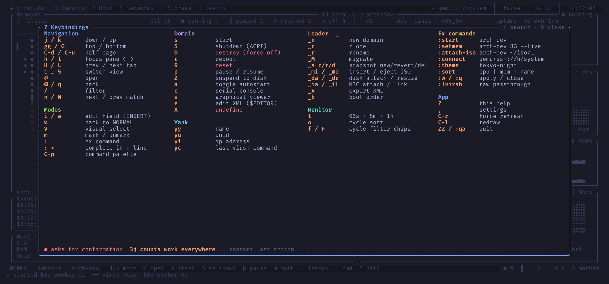

# Key bindings



`?` shows the bindings inside virsh-tui. The overlay is built from the active
key map, so it reflects your `keymap.toml`. Type to filter it.

## Default bindings

### Navigation

| Key | Action | Name |
|-----|--------|------|
| `j` / `k` | down / up | `move_down` / `move_up` |
| `gg` / `G` | top / bottom | `go_top` / `go_bottom` |
| `Ctrl-d` / `Ctrl-u` | half page down / up | `half_down` / `half_up` |
| `Enter` | open | `open` |
| `Backspace`, `q` | back (`q` quits from the top level) | `back` |
| `/` | filter | `filter` |
| `n` / `N` | next / previous match | `next_match` / `prev_match` |
| `H` / `L`, `[` / `]` | previous / next tab | `prev_tab` / `next_tab` |
| `1` … `5` | Domains, Host, Networks, Storage, Events | `view_domains` … `view_events` |

### Domain actions

| Key | Action | Name |
|-----|--------|------|
| `s` | start | `start` |
| `S` | ACPI shutdown | `shutdown` |
| `D` | destroy (force off) | `destroy` |
| `r` | reboot | `reboot` |
| `R` | reset | `reset` |
| `p` | pause / resume | `pause` |
| `Z` | managed save (suspend to disk) | `managed_save` |
| `a` | toggle autostart | `autostart` |
| `c` | serial console | `console` |
| `v` | graphical viewer | `viewer` |
| `e` | edit XML | `edit_xml` |
| `X` | undefine | `undefine` |

### Copy

| Key | Copies | Name |
|-----|--------|------|
| `yy` | name | `yank_name` |
| `yu` | UUID | `yank_uuid` |
| `yi` | IP address | `yank_ip` |
| `yc` | last command | `yank_cmd` |

### Leader (`Space`)

| Key | Action | Name |
|-----|--------|------|
| `Space n` | new domain | `new_domain` |
| `Space c` | clone | `clone` |
| `Space r` | rename | `rename` |
| `Space M` | migrate | `migrate` |
| `Space s c` / `s r` / `s d` | snapshot create / revert / delete | `snapshot_new` / `snapshot_revert` / `snapshot_delete` |
| `Space m i` / `m e` | insert / eject ISO | `insert_media` / `eject_media` |
| `Space d a` / `d r` | attach / resize disk | `disk_attach` / `disk_resize` |
| `Space i a` / `i l` | attach NIC / toggle link | `nic_attach` / `nic_link` |
| `Space x` | export XML | `export_xml` |
| `Space b` | boot order | `boot_order` |
| `Space l` / `Space L` | pin / unpin a DHCP lease | `lease_pin` / `lease_unpin` |

### Lists and monitor

| Key | Action | Name |
|-----|--------|------|
| `m` | mark / unmark | `mark` |
| `V` | visual selection | `visual` |
| `o` | cycle sort | `sort_cycle` |
| `f` / `F` | cycle filter chips | `chip_cycle` / `chip_cycle_back` |
| `t` | history window 60 s / 5 min / 1 h | `window_cycle` |
| `l` | focus the leases table (Networks) | `lease_focus` |
| `u` | undo field (hardware editor) | `undo_field` |
| `gx` | go to the XML tab | `goto_xml` |

### App

| Key | Action | Name |
|-----|--------|------|
| `:` | command line | `ex` |
| `Ctrl-p` | command palette | `palette` |
| `?` | help | `help` |
| `,` | settings | `settings` |
| `Ctrl-r` | refresh now | `refresh` |
| `Ctrl-l` | redraw the screen | `redraw` |
| `.` | repeat the last change | |
| `q`, `ZZ`, `Ctrl-c` | quit | `quit` |

Some screens add their own keys, listed in the status bar: the
[hardware editor](views/detail.md#hardware), the [wizard](wizard.md),
[Networks](views/networks.md) and [Storage](views/storage.md).

## Remapping keys

Create `~/.config/virsh-tui/keymap.toml`:

```toml
[normal]
shutdown = ["S", "Space q"]      # several bindings for one action
snapshot_new = ["Space s n"]     # tokens separated by spaces
console = ["C-t"]
```

- Each entry maps an action name (the "Name" column above) to a list of key
  sequences.
- A sequence is a list of tokens separated by spaces. A token is a single
  character (`a`, `A`, `:`), `C-x` for Ctrl, or one of `Space`, `Enter`,
  `Esc`, `Tab`, `S-Tab`, `Backspace`.
- Remapping an action removes its default keys. List them again if you want
  to keep them.
- Sub-tables such as `[normal.domains]` are accepted to group entries, but
  their bindings apply in every view.

Unknown action names and syntax errors are reported in the message line when
virsh-tui starts; the rest of the file still applies. The help overlay and
the which-key popup show your bindings.

All action names: `move_up`, `move_down`, `go_top`, `go_bottom`, `half_down`,
`half_up`, `open`, `back`, `filter`, `next_match`, `prev_match`, `start`,
`shutdown`, `destroy`, `reboot`, `reset`, `pause`, `managed_save`,
`managed_save_remove`, `autostart`, `console`, `viewer`, `edit_xml`,
`undefine`, `rename`, `clone`, `migrate`, `send_key`, `export_xml`,
`new_domain`, `yank_name`, `yank_uuid`, `yank_ip`, `yank_cmd`, `mark`,
`visual`, `sort_cycle`, `chip_cycle`, `chip_cycle_back`, `window_cycle`,
`lease_focus`, `lease_pin`, `lease_unpin`, `ex`, `palette`, `help`,
`settings`, `refresh`, `redraw`, `quit`, `quit_all`, `snapshot_new`,
`snapshot_revert`, `snapshot_delete`, `insert_media`, `eject_media`,
`disk_attach`, `disk_resize`, `nic_attach`, `nic_link`, `boot_order`,
`prev_tab`, `next_tab`, `undo_field`, `goto_xml`, `view_domains`,
`view_host`, `view_networks`, `view_storage`, `view_events`.
