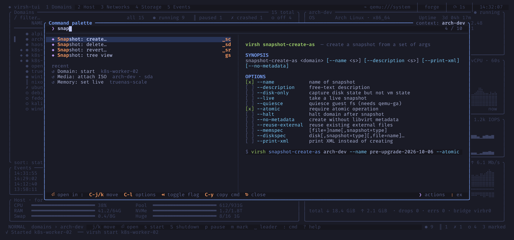

# The command palette

`Ctrl-p` opens a fuzzy finder over every action virsh-tui has, with its key
binding and the domain it applies to. Type a few letters (`snap`, `iso`,
`setmem`) and press `Enter` to run the highlighted entry.

For entries backed by a `virsh` subcommand, the right-hand pane shows its
synopsis and its options as check boxes, so you can add flags such as
`--live` or `--atomic` without remembering their names.

| Key | Action |
|-----|--------|
| type | filter the entries |
| `↑` / `↓`, `Ctrl-k` / `Ctrl-j` | move through the entries, or through the options when the pane has focus |
| `Ctrl-l` | move the focus between the entries and the options pane |
| `Tab` | toggle the option under the cursor |
| `Ctrl-y` | copy the resulting `virsh` command |
| `Enter` | run the entry |
| `Esc` | close |
