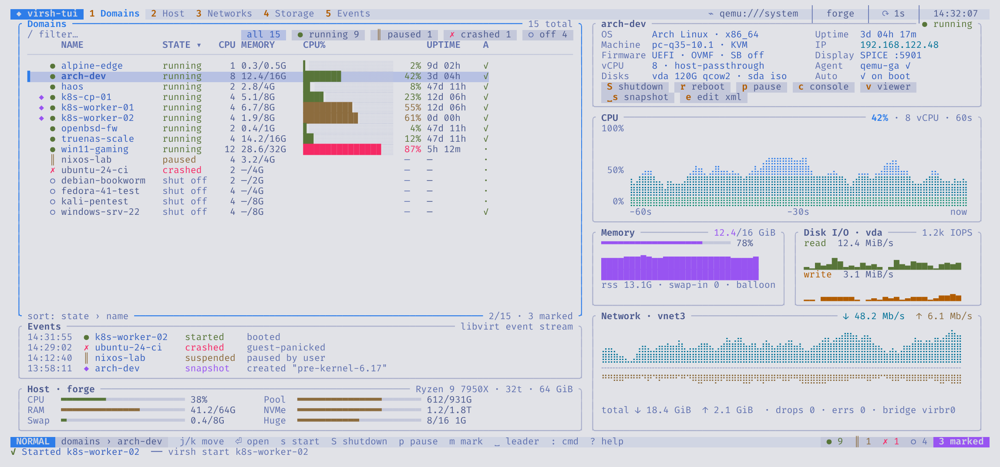

# Themes

virsh-tui ships nine themes. The default is `tokyo-night`.

| Theme | |
|-------|-|
| `tokyo-night` | the default, shown throughout this book |
| `tokyo-night-storm` | a lighter navy background |
| `tokyo-night-day` | light |
| `catppuccin-mocha` | |
| `gruvbox-dark` | |
| `nord` | |
| `dracula` | |
| `kanagawa` | |
| `everforest` | |

Switch with `:theme <name>` (Tab completes the names and previews the
colours), in the settings screen (`,`, Appearance), with `--theme <name>` for
one session, or with `appearance.theme` in the config.

| | |
|-|-|
|  |  |
| `catppuccin-mocha` | `gruvbox-dark` |
|  |  |
| `nord` | `dracula` |
|  | |
| `tokyo-night-day` | |

## Custom themes

A theme is a TOML file in `~/.config/virsh-tui/themes/`. The file name,
without `.toml`, is the theme name. It needs all sixteen colour tokens:

```toml
# ~/.config/virsh-tui/themes/mine.toml
[tokens]
bg      = "#1a1b26"   # main background
bg2     = "#16161e"   # bars and panel headers
hl      = "#292e42"   # highlighted rows, chips, empty bar segments
sel     = "#283457"   # selected row
gutter  = "#3b4261"   # borders
comment = "#565f89"   # dim text
fg      = "#c0caf5"   # text
fg2     = "#a9b1d6"   # secondary text
blue    = "#7aa2f7"
cyan    = "#7dcfff"
magenta = "#bb9af7"
green   = "#9ece6a"
yellow  = "#e0af68"
orange  = "#ff9e64"
red     = "#f7768e"
teal    = "#1abc9c"
```

Then `:theme mine`. A missing token is reported by name in the message line.

Border style, icon set, graph style, gradients and transparency are separate
settings in `[appearance]`, so they work with any theme.

## Terminals without truecolor

virsh-tui checks `COLORTERM`. Without `truecolor` or `24bit`, it maps the
theme to the nearest xterm 256-colour palette entries.
