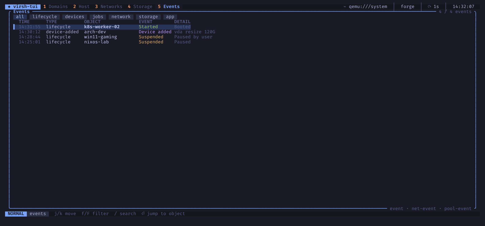

# Events

The events view subscribes to `virsh event`, `virsh net-event` and
`virsh pool-event` and shows what happens on the connection as it happens:
domains starting, stopping, crashing, being defined or undefined, guest agent
connections, balloon changes, media changes, network and pool state changes.

| Key | Action |
|-----|--------|
| `j` / `k` | move through the log |
| `f` / `F` | filter by type: all, lifecycle, devices, jobs, network, storage, app |
| `/` | search the log |
| `Enter` | jump to the object of the event |

The stream reconnects on its own if the daemon restarts. The last few events
also appear on the domains dashboard.
